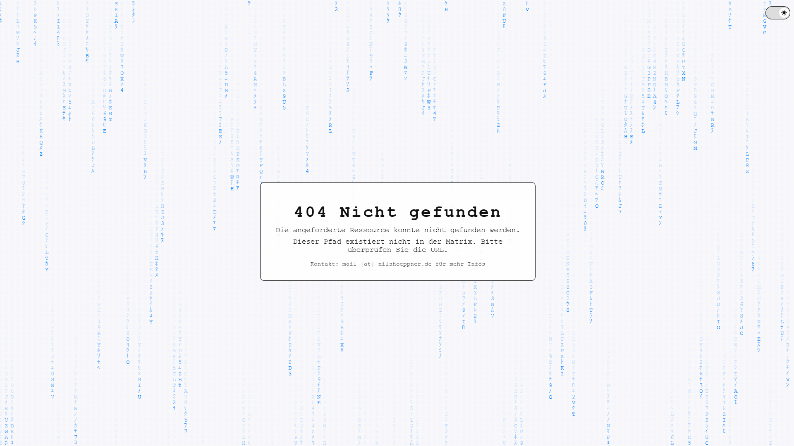

# Matrix like HTTP Error Pages für Nginx Proxy Manager

Dieses Projekt enthält ein Set von Matrix-inspirierten HTML-Fehlerseiten
(401, 403, 404, 500, 501, 502, 503, 504) mit:

- animiertem „Matrix-Regen“ im Hintergrund (Katakana / Ziffern / Buchstaben)
- Dark-/Light-Mode mit iOS-ähnlichem Switch (⏾ / ☀)
- einheitlichem Blue-Matrix-Farbschema (#0080FF)

Die Seiten sind dafür gedacht, in **Nginx Proxy Manager (NPM)** als
globale Error Pages verwendet zu werden.

## Struktur

```
matrix-nginx-error-pages/
├─ README.md
└─ error_pages/
   ├─ matrix_401.html
   ├─ matrix_403.html
   ├─ matrix_404.html
   ├─ matrix_500.html
   ├─ matrix_501.html
   ├─ matrix_502.html
   ├─ matrix_503.html
   └─ matrix_504.html
```

## Dateien

- `matrix_401.html` – 401 Nicht autorisiert  
- `matrix_403.html` – 403 Verboten  
- `matrix_404.html` – 404 Nicht gefunden  
- `matrix_500.html` – 500 Interner Serverfehler  
- `matrix_501.html` – 501 Nicht implementiert  
- `matrix_502.html` – 502 Fehlerhaftes Gateway  
- `matrix_503.html` – 503 Dienst nicht verfügbar  
- `matrix_504.html` – 504 Gateway Timeout  

## Beispiele

### 404‑Seite im Dark‑Mode


### 404‑Seite im Light‑Mode


## Integration in Nginx Proxy Manager

### 1. Dateien nach NPM kopieren

Auf dem Host, auf dem NPM läuft:

```bash
mkdir -p /opt/npm/data/nginx/error_pages
# dann alle HTML-Dateien aus error_pages/ dorthin kopieren
cp error_pages/*.html /opt/npm/data/nginx/error_pages/
```

### 2. Custom `server_proxy.conf` anlegen

Datei:

```bash
mkdir -p /opt/npm/data/nginx/custom
nano /opt/npm/data/nginx/custom/server_proxy.conf
```

Inhalt:

```nginx
proxy_intercept_errors on;

error_page 401 /_matrix_error_401.html;
error_page 403 /_matrix_error_403.html;
error_page 404 /_matrix_error_404.html;
error_page 500 /_matrix_error_500.html;
error_page 501 /_matrix_error_501.html;
error_page 502 /_matrix_error_502.html;
error_page 503 /_matrix_error_503.html;
error_page 504 /_matrix_error_504.html;

location = /_matrix_error_401.html { internal; alias /data/nginx/error_pages/matrix_401.html; }
location = /_matrix_error_403.html { internal; alias /data/nginx/error_pages/matrix_403.html; }
location = /_matrix_error_404.html { internal; alias /data/nginx/error_pages/matrix_404.html; }
location = /_matrix_error_500.html { internal; alias /data/nginx/error_pages/matrix_500.html; }
location = /_matrix_error_501.html { internal; alias /data/nginx/error_pages/matrix_501.html; }
location = /_matrix_error_502.html { internal; alias /data/nginx/error_pages/matrix_502.html; }
location = /_matrix_error_503.html { internal; alias /data/nginx/error_pages/matrix_503.html; }
location = /_matrix_error_504.html { internal; alias /data/nginx/error_pages/matrix_504.html; }
```

### 3. NPM neu laden

Im Docker-Compose-Verzeichnis von NPM (z. B. `/opt/npm`):

```bash
cd /opt/npm
docker compose restart app
# oder:
# docker compose exec app nginx -s reload
```

### 4. Test

- **401/403** über Access Lists testen  
- **404** durch Aufruf eines nicht existierenden Pfads  
- **500/502/503/504** durch abgeschaltete oder fehlerhafte Backends provozieren
